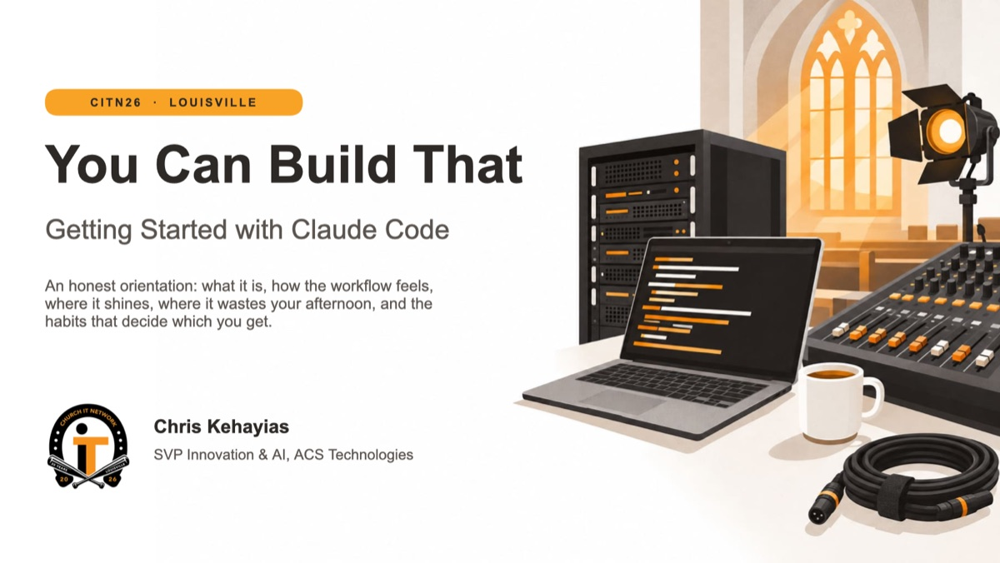
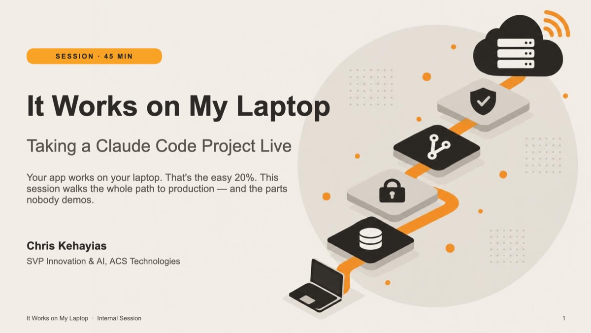
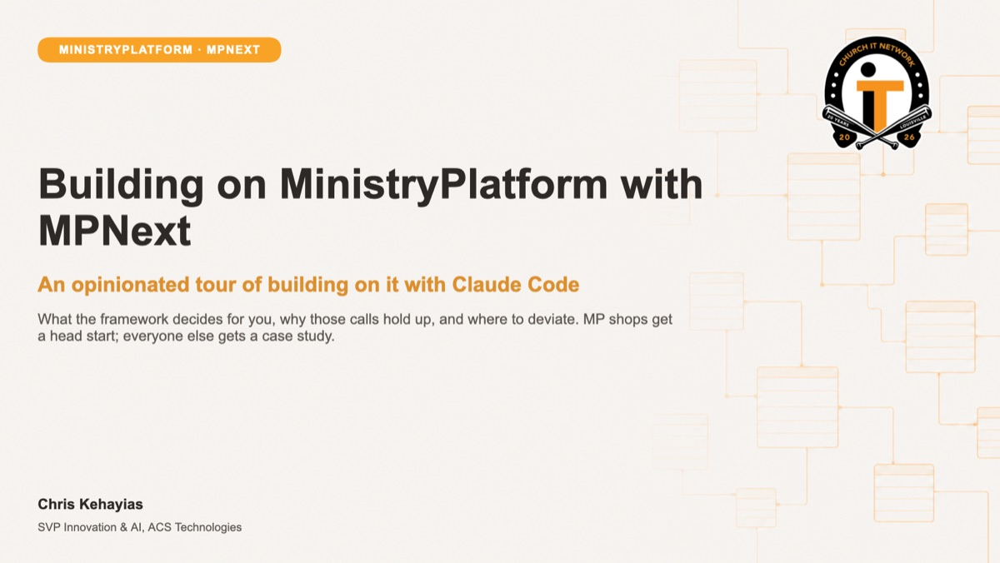
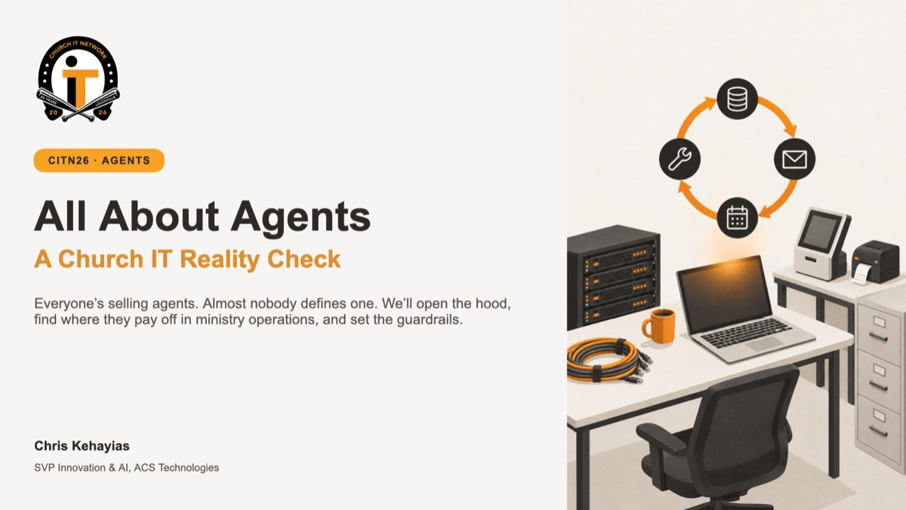
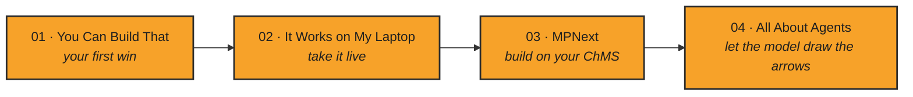

# CITN26 · Session Decks

**Four sessions on building real software in church IT with AI: from a first Claude Code script to production, MinistryPlatform, and agents.**

 

 

*Chris Kehayias · SVP Innovation & AI, ACS Technologies*

---

## The Decks

<table>
  <tr>
    <td width="50%" valign="top">
      
       
      <b>01 · <a href="#you-can-build-that">You Can Build That</a></b> 
      Getting Started with Claude Code · 21 slides
    </td>
    <td width="50%" valign="top">
      
       
      <b>02 · <a href="#it-works-on-my-laptop">It Works on My Laptop</a></b> 
      Taking a Claude Code Project Live · 21 slides
    </td>
  </tr>
  <tr>
    <td width="50%" valign="top">
      
       
      <b>03 · <a href="#building-on-ministryplatform-with-mpnext">Building on MinistryPlatform with MPNext</a></b> 
      An opinionated tour with Claude Code · 16 slides
    </td>
    <td width="50%" valign="top">
      
       
      <b>04 · <a href="#all-about-agents">All About Agents</a></b> 
      A Church IT Reality Check · 24 slides
    </td>
  </tr>
</table>

### Suggested path

The sessions stand on their own, but they also build on each other: start with your first win, take it live, build on your ChMS, then let the model draw the arrows.

---

## You Can Build That

**Getting Started with Claude Code** &nbsp;·&nbsp; 45 min &nbsp;·&nbsp; 21 slides &nbsp;·&nbsp; [📥 Download the deck](You-Can-Build-That-CITN26.pptx)

An honest orientation for church IT generalists: what Claude Code actually is (not a chatbot, not autocomplete, but an agent), how the daily workflow feels, where it shines, where it wastes your afternoon, and the five habits that decide which one you get. The live demo builds a first-time guest follow-up board from a ChMS export, catching bad data along the way.

> **You're the tech lead. It's a fast junior dev with no memory of yesterday.**

- **Live demo:** Plan → Build → Test → Commit, then `/clear`
- **The five habits:** plan before code · small committed steps · a short `CLAUDE.md` · make it prove it · reset instead of arguing
- **Two threes:** if you can't describe "done" in 3 sentences, it's not a first project; after 3 failed tries, `/clear` and restate
- **Takeaways:** AI-SDLC for a team of one (or three), plus a shortlist of first projects you can check by dinner

---

## It Works on My Laptop

**Taking a Claude Code Project Live** &nbsp;·&nbsp; 45 min &nbsp;·&nbsp; 21 slides &nbsp;·&nbsp; [📥 Download the deck](It-Works-on-My-Laptop.pptx)

Your prototype is the easy 20%. This session covers the other 80%: data, hosting, CI/CD, secrets, migrations, monitoring, cost, and who gets paged. Six live demos on a **Neon + Vercel + GitHub Actions** stack take one real change from laptop to production, roll it back, and then break it on purpose.

> **It's not "can I deploy this." It's "who's holding the pager at 2am."**

- **The stack and its traps:** serverless Postgres, git-connected hosting, and CI as the gate in front of `main`
- **Five stops to production:** laptop → secrets → migrations → preview env → promote
- **Database branch per PR,** preview environments, and one-click rollback
- **What nobody demos:** monitoring, real monthly cost, and deciding who gets paged *before* launch

---

## Building on MinistryPlatform with MPNext

**An opinionated tour of building on it with Claude Code** &nbsp;·&nbsp; 45 min &nbsp;·&nbsp; 16 slides &nbsp;·&nbsp; [📥 Download the deck](Building-on-MinistryPlatform-with-MPNext.pptx)

A tour of what the MPNext starter decides for you, why those calls hold up, and where to deviate. It covers OAuth, 301 generated TypeScript models and Zod schemas, and the MPHelper service layer. MinistryPlatform shops get a head start. Everyone else gets a case study in turning codegen into context for an AI agent.

> **Codegen isn't just types. It's your agent's memory.**

- **Five layers, one call away:** Presentation → Auth → Service → Provider → Data
- **Live demo:** read schema → scaffold → validate → test → `/pr`, all in Claude Code
- **Two numbers:** 301 typed models and 190+ test cases
- **The ecosystem:** [MPNext](https://github.com/MinistryPlatform-Community/MPNext) · [MPNext-Widgets](https://github.com/MinistryPlatform-Community/MPNext-Widgets) · [MPNext-Tools](https://github.com/MinistryPlatform-Community/MPNext-Tools)

---

## All About Agents

**A Church IT Reality Check** &nbsp;·&nbsp; 45 min &nbsp;·&nbsp; 24 slides &nbsp;·&nbsp; [📥 Download the deck](All-About-Agents-CITN26.pptx)

Everyone's selling agents, but almost nobody defines one. This session opens the hood, shows how to tell an agent from a chatbot or a workflow, finds where agents pay off in ministry operations, and sets the guardrails your exec pastor will ask about. It includes a live MCP demo: a lapsed-participant sweep, start to finish.

> **If a human drew every arrow in advance, it's a workflow. If the model draws the arrows while it runs, it's an agent.**

- **Four parts, one loop:** model · tools · context · a stopping condition
- **Agent vs. autonomous agent,** and MCP as "USB-C for AI tools"
- **Guardrails:** approvals, PII, spend caps, and audit trails, with every tool tiered from Read to Never
- **Take home:** the Real Agent checklist, plus eight starter agents that watch and flag but never fix

---

## How to use these decks

- **Download:** GitHub doesn't preview `.pptx` files. Open a deck and click **Download raw file** (↓), or clone the repo.
- **Speaker notes:** the Claude Code, Laptop, and Agents decks include presenter notes with timing cues and demo scripts. Open **View → Notes** in PowerPoint to see them.
- **Reuse:** you're welcome to borrow ideas, frameworks, and checklists for your own team or church. A credit back is appreciated.

 

**Build the small version first.**

Presented at CITN26 · Louisville, KY · Chris Kehayias ([@chriskehayias](https://github.com/chriskehayias)) · ACS Technologies

